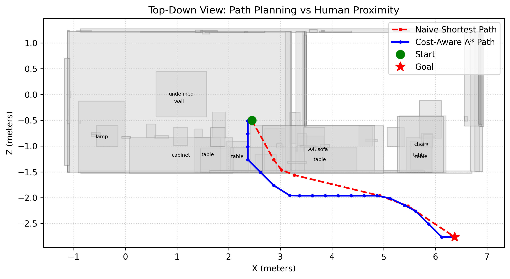
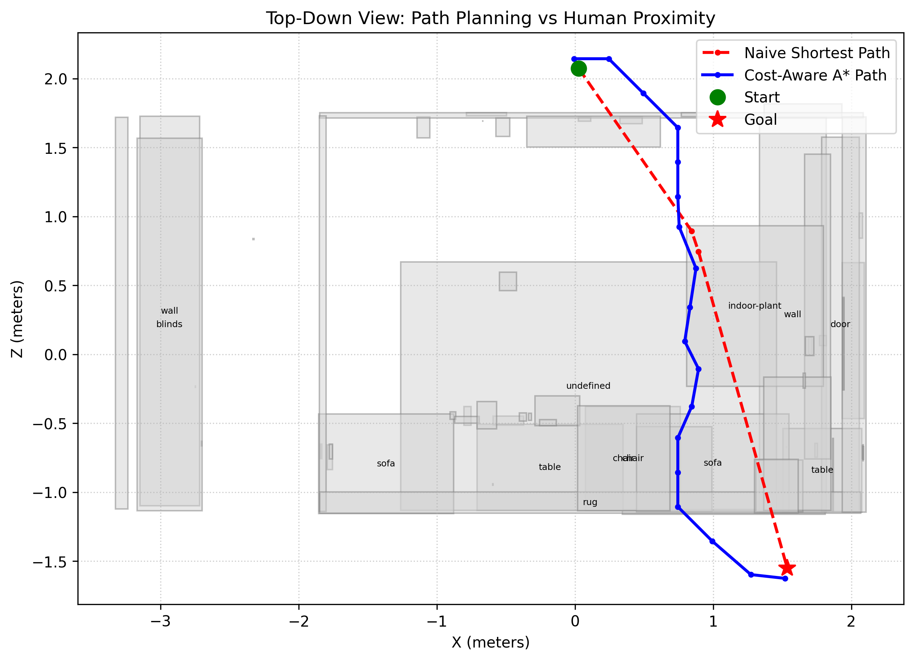

# Human-Aware Robot Path Planning via Local LLM Trajectory Prediction

## Research Hypothesis
**Can dynamic, LLM-generated heuristics prevent "frozen robot" problems in cost-aware navigation without incurring massive path overhead?**

Cost-aware path planners (like A*) often struggle in narrow indoor environments: if they are penalized for passing near human interaction zones, they may calculate that navigating a room is too "expensive" and freeze, or take absurd physical detours to avoid a minor risk. 

This project is a simulation-based prototype that tests whether we can solve this by generating **scene-specific, dynamic heuristics** using a local Large Language Model (`llama3.2:3b`). Instead of relying on static rules, the system queries the LLM at runtime to predict human behavior based on the specific semantic objects in the room, propagates that probability over a Continuous-Time Markov Chain, and applies a **quadratic penalty** to force the A* planner to actively avoid peak danger spikes.

## Methodology

To test this hypothesis under realistic engineering constraints, I built an end-to-end evaluation pipeline bridging perception, language, and planning:

1. **Semantic Scene Graph:** Parses Habitat's `info_semantic.json` to ground the LLM in the specific objects of the current room (inspired by DAAAM).
2. **Dynamic Trajectory Prediction:** Queries the LLM to generate a custom compatibility matrix of likely human interactions, then propagates spatial probability over the scene graph via a Continuous-Time Markov Chain (inspired by LP2).
3. **Map Compression:** Filters non-task-relevant objects out of the environment to reduce ambient probability noise (inspired by Clio).
4. **Quadratic Cost-Aware Planner:** Evaluates the human proximity cost field on a dense NavMesh and calculates a detour path via A* that penalizes peak danger zones using a non-linear quadratic cost function.

## Visual Results

**Left:** `room_0` showing a successful Cost-Aware detour (Blue) routing around the high-probability human zones. 

**Right:** `office_0` showing a topological bottleneck where the planner is forced to cross danger zones.

<p align="center">
  
  
</p>

## Quantitative Results

Across 3 indoor scenes, the custom Cost-Aware A* path successfully identified and bypassed high-probability zones at the expense of a slightly longer total travel distance. To combat A*'s tendency to optimize for average cost over peak danger, we implemented **quadratic human-cost penalties** and evaluated the planner using both Average Safety and **Peak Safety** (Maximum Danger) metrics.

| Scene Name        | Avg Safety Imp % | Peak Safety Imp % | Naive Peak | Aware Peak | Path Length Ratio |
|-------------------|------------------|-------------------|------------|------------|-------------------|
| `office_0`        | -7.02%           | -10.76%           | 0.2610     | 0.2891     | 1.196x            |
| `office_0_noclio` | -6.33%           | -6.33%            | 0.2767     | 0.2942     | 1.196x            |
| `room_0`          | 16.66%           | 8.64%             | 0.2004     | 0.1831     | 1.111x            |
| `room_0_noclio`   | 13.10%           | 0.00%             | 0.1608     | 0.1608     | 1.083x            |
| `room_1`          | -6.48%           | 0.00%             | 0.0989     | 0.0989     | 1.040x            |
| `room_1_noclio`   | 14.09%           | 0.00%             | 0.1615     | 0.1615     | 1.169x            |

*(Note: The 0.00% Peak Improvement in several runs indicates that the absolute highest danger point occurred exactly at the starting or ending coordinate, making the peak mathematically unavoidable. In severe bottlenecks like `office_0`, A* calculated that enduring a higher peak of 0.2891 was still mathematically cheaper than taking an immense physical detour around the entire office layout.)*

### Dynamic Heuristics & Clio Ablation Study
Instead of relying on a static, hand-coded transition matrix, the pipeline queries the LLM at runtime to generate a **Dynamic Compatibility Matrix** tailored to the unique classes found in each room. This eliminated structural biases and boosted `room_0`'s Average Safety Improvement to a staggering **16.66%**.

When the pipeline was run with the Clio map filter disabled (`_noclio`), we observed distinct shifts. In `room_0`, Clio successfully suppressed background noise, improving the average safety gain from 13.10% to 16.66% and unlocking an 8.64% peak improvement. However, in `room_1`, Clio's strict text-filtering inadvertently degraded performance compared to the unfiltered map, highlighting a critical area for future LLM-vision alignment research.

### Trajectory Prediction Evaluation
To isolate the performance of the LLM trajectory predictor (LP2), we evaluated the zero-shot predictions of `llama3.2:3b` against a set of ground-truth human interaction sequences. The LLM achieved a **Top-3 Recall of 16.7%** and a fallback rate of 14.3%. Qualitative analysis revealed that while the LLM successfully predicts generic semantic affordances (e.g., `switch` -> `lamp`), it struggles to zero-shot predict the specific temporal sequence of an embodied human trajectory (e.g., `switch` -> `sofa` -> `book`). This limitation strongly justifies our architectural choice to use the Continuous-Time Markov Chain (CTMC) downstream, which diffuses point-estimate uncertainty into a broader, more robust spatial probability field for the A* planner.

## How to Run

Execute the end-to-end pipeline across all evaluation scenes:

```bash
bash scripts/run_all_scenes.sh
```

To run a single scene and output the top-down visualization and metrics:

```bash
bash scripts/demo.sh datasets/replica/room_0
```

## Known Limitations

- **Simulated Human Movement:** We approximate human probability via CTMC instead of executing a fully embodied human avatar.
- **2D Planning:** Path planning uses standard floor-level navigation and doesn't fully account for 3D human pose (e.g., reaching or bending).
- **Hardcoded NavMesh Parsing:** Real robots must build semantic maps via SLAM, whereas this project bypasses vision constraints by leveraging the Replica ground truth annotations.
